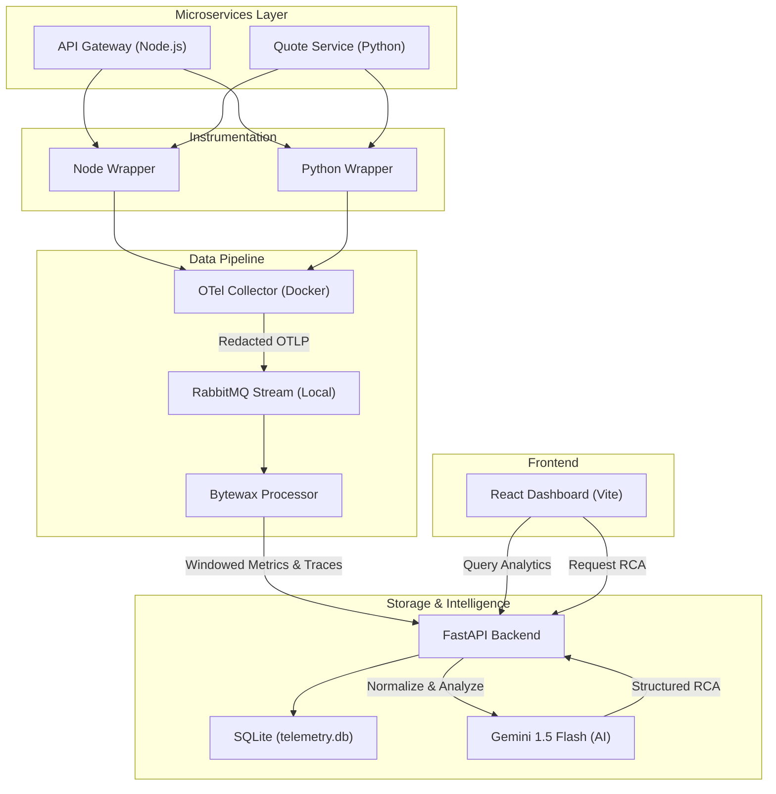
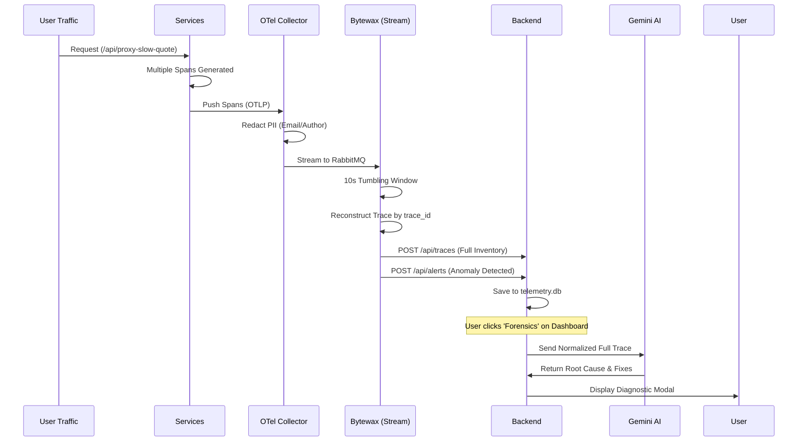

# ObserverAI: High-Precision Forensics & Telemetry Platform

ObserverAI is a premium observability stack designed for multi-service environments. It features automated instrumentation, high-throughput stream processing with Bytewax, and an AI-powered diagnostic engine fueled by Gemini.

## 🏗️ System Architecture



## 🔍 Forensic Activity Flow

This diagram illustrates how Phase 5 reconstructs cross-service traces for AI analysis.



## 🚀 Getting Started

### Prerequisites
- Docker & Docker Compose
- RabbitMQ installed locally (v3.9+)
- Python 3.10+ & Node.js 18+
- Gemini API Key

### Running the Stack

1. **Environment Setup**
   Ensure your `.env` in `dashboard/backend/` has:
   ```env
   GEMINI_API_KEY=your_key_here
   ```

2. **Run the Master Script**
   Execute the unified startup script from the root directory:
   ```bash
   chmod +x start.sh
   ./start.sh
   ```

3. **Explore the Dashboard**
   Open your browser at: `http://localhost:5173`

## ✨ Key Features (Phase 5)
- **AI RCA**: Instant root cause analysis with suggested fixes.
- **Trace Waterfall**: Multi-service visualization reconstructed in flight.
- **Sparkline Wave**: Real-time throughput and latency trends.
- **Resource Saturation**: Live CPU and Memory tracking.
- **Sidebar Controls**: Production-grade toggles for Live Mode and Auto-Correlation.
